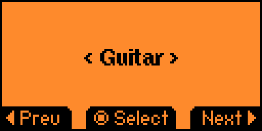
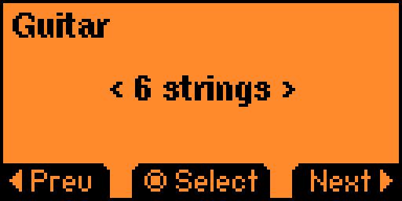
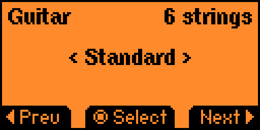
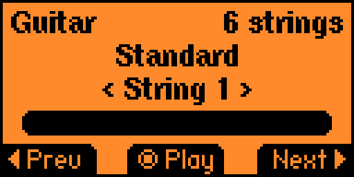

# Tuning Fork

A tuning fork for the [Flipper Zero](https://flipperzero.one/) device.
Allows to play different notes in different pitches.






## Features
- Tuning forks (440Hz, 432Hz, etc.)
- Scientific pitch (..., 256Hz, 512Hz, 1024Hz, ...)
- Guitar Standard (6 strings)
- Guitar Drop D (6 strings)
- Guitar D (6 strings)
- Guitar Drop C (6 strings)
- Guitar Standard (7 strings)
- Guitar Drop A (7 strings)
- Bass Standard (4 strings)
- Bass Tenor (4 strings)
- Bass Drop D (4 strings)
- Bass D (4 strings)
- Bass Standard (5 strings)
- Bass Tenor (5 strings)
- Bass Drop A (5 strings)
- Ukulele Standard (4 strings)
- Banjo Standard (5 strings)
- Cigar Box Open G (3 string)
- Cigar Box Open D (3 string)
- Cigar Box Open A (3 string)
- Cigar Box Open G (4 string)

## Development

### Install ufbt
> Linux & macOS: `python3 -m pip install --upgrade ufbt`
> Windows: `py -m pip install --upgrade ufbt`

### Clone repo
```
git clone https://github.com/besya/flipperzero-tuning-fork.git
```
### Navigate to project folder
```
cd flipperzero-tuning-fork
```
### Prepare VSCode environment
```
ufbt vscode_dist
```
### Build app
```
ufbt
```
> This command creates dist/tuning_fork.fap

### Launch app
```
ufbt launch
```
> This command deploys app to Flipper Zero and launches an application

## Contibuting

1. Fork repo
1. Clone
1. Create branch
1. Make changes
1. Commit changes and push to branch
1. Open fork page and click Contribute
1. Create a pull-request from your branch to this repo's main branch

## Acknowledgements

Special thanks to:
- [@xMasterX](https://github.com/xMasterX) for distributing and support
- [@RogueMaster](https://github.com/RogueMaster) for distribution and support
- [@Willy-JL](https://github.com/@Willy-JL) for fixes
- [@panki27](https://github.com/@panki27) for inspiration
- The Flipper Zero community for support and feedback

## License

This project is licensed under the GNU GPL v3 - see the [LICENSE](LICENSE) file for details.
